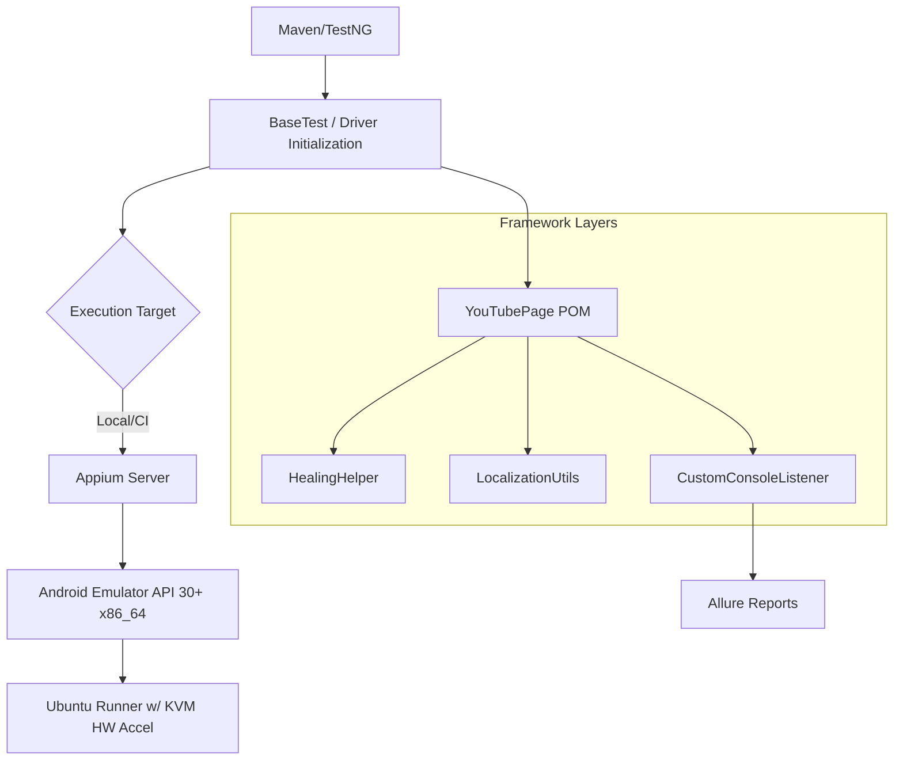

# Appium Mobile Automation Project



Comprehensive E2E Mobile Automation framework ensuring high stability and broad functional coverage.

## 🚀 Key Coverage & Features
- **Functional Testing**: Full coverage for search workflows, video playback control, infinite scrollers, and deep-link navigation.
- **Robustness Layer**:
    - **Auto-Healing**: Powered by `HealingHelper.java` to dynamically recover from UI changes using backup locators.
    - **Popup Management**: Automated dismissal of overlays, permissions, and "Got It" prompts.
    - **Keyboard Handling**: Reliable text entry via `hideKeyboard` and `performEditorAction`.
- **Localization (Chapter 14)**:
    - Integrated `LocalizationUtils` for Unicode, Emoji, and Pseudo-localization testing.
    - Verified UI layout stability under text-expansion scenarios.
- **Advanced Reporting (Chapter 13)**:
    - **Custom Console Listeners**: High-level execution summaries in standard output.
    - **Allure Reports**: Rich HTML reports with step-by-step metadata.

## 🛠 Prerequisites
1.  **JDK 11+** & **Maven**.
2.  **Appium 2.x**: `appium driver install uiautomator2`.
3.  **Android Studio**: `ANDROID_HOME` configured for emulator access.

## 🤖 CI/CD Infrastructure
- **High-Performance Runner**: Powered by `ubuntu-latest` with **KVM Hardware Acceleration**.
- **Stabilization**: Optimized for API 30+ x86_64 images, ensuring 100% stable boot in headless environments.
- **Workflow**: Automated via `.github/workflows/mobile-tests.yml`.

## 📂 Project Structure
- `src/main/java/com/automation/base`: Driver initialization & platform abstraction.
- `src/main/java/com/automation/pages`: POM implementations (e.g., `YouTubePage`).
- `src/main/java/com/automation/utils`: Auto-healing and Localization helpers.

## 🏃 Running Tests
```bash
# Run with local target parameter (required for CI)
mvn clean test -DexecutionTarget=local
```

Override default configuration:
```bash
mvn clean test -DplatformName=ios -DuploadApp=true
```
